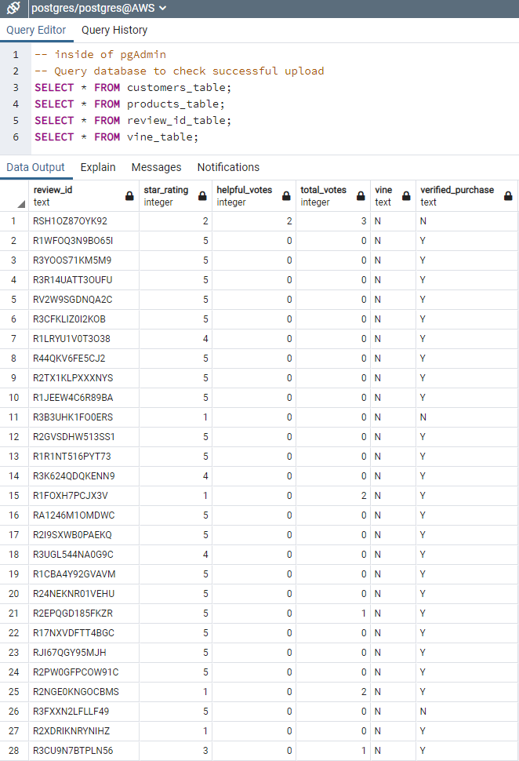
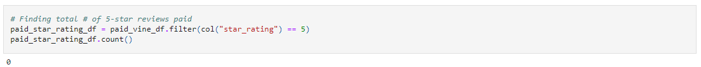
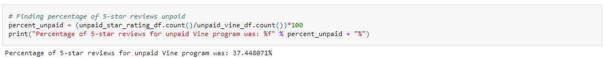

# Amazon Vine Analysis

Big Data using 
* PySpark
* Amazon Web Service (AWS)
* S3
* Google Colaboratory
* pgAdmin4

## Overview of the Analysis
Various natural language processing skills were explored to prepare a customer review analysis for a client interested in digital video games.      

### Topics Explored
* Define big data and describe the challenges associated with it.
* Define Hadoop and name the main elements of its ecosystem.
* Explain how MapReduce processes data.
* Define Spark and explain how it processes data.
* Describe how NLP collects and analyzes text data.
* Explain how to use AWS Simple Storage Service (S3) and relational databases for basic cloud storage.
* Complete an analysis of an Amazon customer review.

#### Example
Example of using Google Colab, PySpark scripts, AWS, S3 to data load into pgAdmin:  
     

### Results

#### How many Vine reviews and non-Vine reviews were there?
The dataset contains 145,431 reviews, and on the smallest side of Big Datasets. Analysis was as follows:
* Reviews with 20 or more votes where considered for the rest of the analysis leaving 3,342 reviews. 
* Helpful votes were defined as being 50% or greater than the total votes narrowing the list to 1,685 reviews.

Due to the applied criteria, it diminished the sample size.  
* In the remainder 1,685 reviews, there were no reviews that were paid for by the Vine program as seen in the image below.     

##### Finding the percentages of 5 Star paid reviews: 
     

All 1,656 remaining reviews are unpaid Vine with 0 paid Vine.  

### How many Vine reviews were 5 stars? How many non-Vine reviews were 5 stars?     
* There were 631 reviews.  
* Attempting to divide by zero, the code would result in a zero division error.  
* Therefore, there are also 0 paid Vine with 5-star reviews.     

### What percentage of Vine reviews were 5 stars? What percentage of non-Vine reviews were 5 stars? 
##### Finding the percentage of 5 star unpaid reviews:
   

* 5-star Vine unpaid reviews resulted in 37.4%
* Percentage of paid, 5-star Vine reviews would be 0%.   

# Summary
Because the sample size was constricted to a degree that it was impossible to compare paid and unpaid Vine reviews, the analysis is biased towards unpaid Vine reviews.  Another indicator is comparing 37% of unpaid, 5-star Vine reviews to 0% paid, 5-star Vine reviews also shows that the unpaid Vine are biased as well.

The starting criteria of 20 likes or the 50% helpful criteria may have been too high, which made the data set too small.  Adjustments to these criteria is a first step to reconsidering using this data set.
